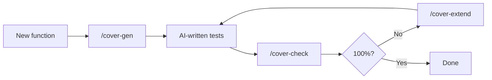

# claude-coverwise

[](https://github.com/libraz/claude-coverwise/actions)
[](LICENSE)
[](https://nodejs.org/)
[](https://yarnpkg.com/)
[](https://biomejs.dev/)
[](https://modelcontextprotocol.io/)
[](https://docs.claude.com/en/docs/claude-code)
[](https://github.com/libraz/coverwise)

Pairwise / t-wise combinatorial coverage for AI-written tests, delivered as a Claude Code plugin.

When Claude writes tests for code that takes multiple parameters — CLI flags, config options, feature flags, query params, form fields, state machines — it often picks a handful of "reasonable" cases and misses interactions. `claude-coverwise` gives Claude the tools and the knowledge to do this properly: build a parameter model, detect uncovered interactions, and generate or extend the minimum test matrix that exercises every combination that matters.

Under the hood it wraps [**coverwise**](https://github.com/libraz/coverwise), a WASM-first combinatorial test engine, as an MCP server.

## What's in the box

- **MCP server** exposing the coverwise engine (`generate`, `analyze_coverage`, `extend_tests`, `estimate_model`)
- **Skill** that teaches Claude the constraint DSL, common recipes, and the anti-patterns to avoid
- **Slash commands** for the three everyday operations:
  - `/cover-check` — analyze the current test file's combinatorial coverage and list gaps
  - `/cover-gen` — build a fresh minimum test matrix for a function or endpoint
  - `/cover-extend` — append the minimum new tests to reach full coverage, leaving existing tests alone

## The loop



Most combinatorial tools only support generation. coverwise — and therefore this plugin — treats *analyze* and *extend* as first-class operations, which matches how people (and AIs) actually write tests: iteratively, on top of what's already there.

## Install

```
/plugin marketplace add libraz/claude-coverwise
/plugin install claude-coverwise
```

That's it. On the first Claude Code session after installation, a `SessionStart` hook automatically installs the MCP server's runtime dependencies into `${CLAUDE_PLUGIN_DATA}` — a location that survives plugin updates. The install is idempotent and silent on subsequent sessions.

Requirements:

- **Node ≥ 22** and **npm** on your `PATH` (npm ships with Node; no separate install needed).

### For contributors / local development

Clone the repo and install dev dependencies with Yarn 4 (pinned via Volta):

```bash
git clone https://github.com/libraz/claude-coverwise
cd claude-coverwise
yarn install
```

The pinned toolchain (Node 22.21.1, Yarn 4.12.0) is declared in `package.json` under `volta`. [Volta](https://volta.sh/) will apply it automatically.

## How it gets invoked

Installing the plugin does **not** mean Claude will reach for it on every test. The plugin is designed to stay out of the way for trivial cases and engage when combinatorial coverage actually matters.

**Auto-invoked** — the bundled skill's description matches and Claude decides on its own:

- You ask Claude to write tests for a function / component with **≥ 3 independent parameters** (flags, enums, modes, config options, query params, form fields, state machine inputs).
- You mention "pairwise", "t-wise", "covering array", "combinatorial", or "test matrix".
- The parameter space is obviously large and a hand-written cartesian product would be unreasonable.

**Not auto-invoked** — you'll want to ask or use a slash command:

- Small tests with only 1–2 parameters (correct behavior — pairwise would be overkill).
- "Is my existing test suite actually covering everything?" — Claude doesn't audit existing tests unprompted. Run `/cover-check`.
- Filling gaps in a suite you wrote by hand. Run `/cover-extend`.

**Explicit commands** — always available:

| Command | When to use |
|---|---|
| `/cover-check [path]` | Ask Claude to audit an existing test file's combinatorial coverage |
| `/cover-gen [target]` | Build a fresh minimum test matrix for a function / endpoint |
| `/cover-extend [path]` | Append the minimum new tests to reach full coverage without touching existing ones |

### Make it the default for a project

Drop a few lines into your project's `CLAUDE.md` to nudge Claude to consider coverwise whenever it writes tests in this repo:

```markdown
## Testing

When writing tests for functions or components with ≥ 3 input parameters,
use the coverwise MCP tools (analyze_coverage / generate / extend_tests)
to verify combinatorial coverage before finishing. Prefer /cover-check for
auditing existing tests and /cover-extend for filling gaps. See the
coverwise skill for the constraint DSL.
```

This raises the plugin from "opportunistic" to "default when applicable" for that project, without being so aggressive that it triggers on trivial cases.

## Example

> *"Write tests for `render(theme, density, locale, dir)` where theme ∈ {light, dark, hc}, density ∈ {compact, cozy}, locale ∈ {en, ja, ar}, dir ∈ {ltr, rtl}. Arabic must be RTL; everything else LTR."*

Claude calls the `generate` tool with:

```json
{
  "parameters": [
    { "name": "theme",   "values": ["light", "dark", "hc"] },
    { "name": "density", "values": ["compact", "cozy"] },
    { "name": "locale",  "values": ["en", "ja", "ar"] },
    { "name": "dir",     "values": ["ltr", "rtl"] }
  ],
  "constraints": [
    "IF locale = ar THEN dir = rtl",
    "IF locale IN {en, ja} THEN dir = ltr"
  ]
}
```

and writes ~9 tests covering every valid 2-way interaction instead of the 36-case cartesian product. The constraint DSL supports `IF/THEN/ELSE`, `AND/OR/NOT`, relational operators, `IN`, and `LIKE` — see the bundled skill for the full grammar and recipes.

## MCP tools

| Tool | Purpose |
|---|---|
| `generate` | Build a minimal t-wise test suite from parameters + constraints |
| `analyze_coverage` | Report missing parameter interactions in an existing suite |
| `extend_tests` | Add the minimum extra tests to reach 100%, preserving existing ones |
| `estimate_model` | Sanity-check a model (tuple count, estimated tests) before generating |

All tools return structured JSON. Uncovered tuples come with human-readable `display` strings and a `reason` that distinguishes real gaps from constraint-excluded combinations.

## Using outside Claude Code

The MCP server is a plain stdio server and works with any MCP client (Cursor, Cline, Claude Desktop, …). Point your client at `mcp/server.mjs`:

```json
{
  "mcpServers": {
    "coverwise": {
      "command": "node",
      "args": ["/absolute/path/to/claude-coverwise/mcp/server.mjs"]
    }
  }
}
```

after installing runtime dependencies (`npm install --omit=dev` or `yarn install`) in the project root.

## About coverwise

The engine underneath is [**coverwise**](https://github.com/libraz/coverwise) — a WASM-first C++17 combinatorial test engine with a pure TypeScript fallback, supporting arbitrary t-wise strength, a full constraint DSL, negative tests, mixed-strength sub-models, boundary values, and equivalence classes. This plugin is a thin shell that exposes its JS API to Claude Code.

## License

[Apache License 2.0](LICENSE)
