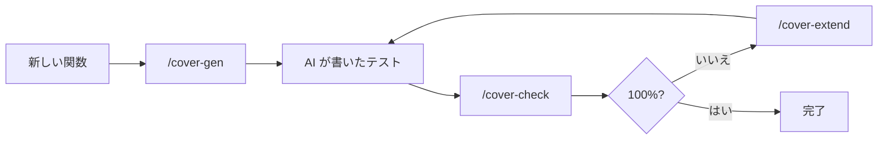

# claude-coverwise

[](https://github.com/libraz/claude-coverwise/actions)
[](LICENSE)
[](https://nodejs.org/)
[](https://yarnpkg.com/)
[](https://biomejs.dev/)
[](https://modelcontextprotocol.io/)
[](https://docs.claude.com/en/docs/claude-code)
[](https://github.com/libraz/coverwise)

AI が書くテストのための pairwise / t-wise 組合せカバレッジを、Claude Code プラグインとして提供します。

Claude が複数パラメータを持つコード — CLI フラグ、設定オプション、フィーチャーフラグ、クエリパラメータ、フォーム項目、状態遷移 — のテストを書くとき、しばしば「それっぽい」ケースをいくつか選んで相互作用を取りこぼします。`claude-coverwise` は、パラメータモデルを作り、未カバーの組合せを検出し、必要な最小のテスト行列を生成 / 追加するための**ツールと知識**を Claude に渡します。

裏側で動いているのは [**coverwise**](https://github.com/libraz/coverwise) — WASM ファーストの組合せテストエンジンで、本プラグインはこれを MCP サーバーとして公開する薄いラッパーです。

## 同梱物

- **MCP サーバー** — coverwise エンジンを 4 ツール(`generate` / `analyze_coverage` / `extend_tests` / `estimate_model`)として公開
- **Skill** — 制約 DSL の文法、定番レシピ、避けるべきアンチパターンを Claude に教える
- **スラッシュコマンド** — 日常的な 3 操作:
  - `/cover-check` — 現在のテストファイルの組合せカバレッジを解析し、不足を列挙
  - `/cover-gen` — 関数 / エンドポイントに対する最小テスト行列を新規生成
  - `/cover-extend` — 既存テストは触らず、100% に到達するための最小テストだけ追加

## ワークフロー



多くの組合せテストツールは「生成」だけをサポートしますが、coverwise — したがって本プラグイン — は**解析**と**追加**を第一級の操作として扱います。これは人間(そして AI)が実際にテストを書いていく流れ — 既存の上に反復的に積み上げる — と噛み合っています。

## インストール

```
/plugin marketplace add libraz/claude-coverwise
/plugin install claude-coverwise
```

以上です。インストール後の最初の Claude Code セッションで `SessionStart` フックが自動的に動き、MCP サーバーの実行時依存を `${CLAUDE_PLUGIN_DATA}`(プラグイン更新後も保持される領域)にインストールします。べき等なので、2 回目以降は静かにスキップされます。

要件:

- **Node 22 以上** と **npm** が `PATH` にあること(npm は Node 同梱なので別途インストール不要)

### コントリビューター / ローカル開発向け

リポジトリをクローンして Yarn 4(Volta で固定)で開発依存を入れます:

```bash
git clone https://github.com/libraz/claude-coverwise
cd claude-coverwise
yarn install
```

ツールチェーン(Node 22.21.1、Yarn 4.12.0)は `package.json` の `volta` フィールドに固定されており、[Volta](https://volta.sh/) を入れていれば自動で適用されます。

## どうやって発動するか

プラグインを入れただけで Claude がすべてのテストで勝手に使ってくれるわけでは**ありません**。些細なケースでは邪魔にならず、組合せカバレッジが実際に問題になる場面でだけ動くように設計されています。

**自動で発動する場面** — 同梱 Skill の description にマッチして Claude が自発的に判断:

- **3 つ以上の独立したパラメータ**(フラグ、enum、モード、設定項目、クエリパラメータ、フォーム項目、状態遷移入力)を持つ関数 / コンポーネントのテスト作成を依頼されたとき
- 「pairwise」「t-wise」「covering array」「組合せテスト」「テスト行列」といった語が出たとき
- パラメータ空間が明らかに大きく、手書きの直積では非現実的なとき

**自動では発動しない場面** — 明示的に指示するかスラッシュコマンドを使ってください:

- パラメータが 1〜2 個しかない小さなテスト(これは正しい挙動 — 過剰適用を避けている)
- 「今あるテストは本当に網羅できてる?」— Claude は自発的に既存テストを監査しません。`/cover-check` を使ってください
- 手で書いたテスト集合の不足を埋めたいとき。`/cover-extend` を使ってください

**明示コマンド** — いつでも使えます:

| コマンド | 使いどころ |
|---|---|
| `/cover-check [path]` | 既存テストファイルの組合せカバレッジを監査させる |
| `/cover-gen [target]` | 関数 / エンドポイントに対する最小テスト行列を新規生成 |
| `/cover-extend [path]` | 既存テストを触らず、100% 到達のための最小テストだけ追加 |

### プロジェクトのデフォルトにする

プロジェクトの `CLAUDE.md` に数行加えると、そのリポジトリでテストを書くたびに Claude が coverwise の利用を検討するようになります:

```markdown
## テスト

3 つ以上の入力パラメータを持つ関数 / コンポーネントのテストを書くときは、
仕上げる前に coverwise MCP ツール(analyze_coverage / generate / extend_tests)
を使って組合せカバレッジを確認すること。既存テストの監査には /cover-check を、
不足の追加には /cover-extend を優先する。制約 DSL の詳細は同梱 Skill を参照。
```

これで、プラグインは「機会があれば使う」から「該当時は既定で使う」へ格上げされますが、些細なケースにまで暴走することはありません。

> Claude Code 以外での利用時も、プロジェクトルートで実行時依存(`npm install --omit=dev` または `yarn install`)をインストールしてから `mcp/server.mjs` を MCP クライアントに登録してください。

## 使用例

> *「`render(theme, density, locale, dir)` のテストを書いて。theme ∈ {light, dark, hc}、density ∈ {compact, cozy}、locale ∈ {en, ja, ar}、dir ∈ {ltr, rtl}。アラビア語は RTL、それ以外は LTR。」*

Claude は `generate` ツールを次の入力で呼び出します:

```json
{
  "parameters": [
    { "name": "theme",   "values": ["light", "dark", "hc"] },
    { "name": "density", "values": ["compact", "cozy"] },
    { "name": "locale",  "values": ["en", "ja", "ar"] },
    { "name": "dir",     "values": ["ltr", "rtl"] }
  ],
  "constraints": [
    "IF locale = ar THEN dir = rtl",
    "IF locale IN {en, ja} THEN dir = ltr"
  ]
}
```

これで 36 通りの直積ではなく、有効な 2-way 相互作用をすべてカバーする ~9 ケースが返ります。制約 DSL は `IF/THEN/ELSE`、`AND/OR/NOT`、関係演算子、`IN`、`LIKE` をサポートしています。完全な文法とレシピは同梱 Skill を参照してください。

## MCP ツール

| ツール | 役割 |
|---|---|
| `generate` | parameters + constraints から最小の t-wise テスト集合を生成 |
| `analyze_coverage` | 既存テスト集合の未カバー組合せを報告 |
| `extend_tests` | 既存を保持したまま、100% 到達のための最小テストを追加 |
| `estimate_model` | 生成前にモデルを確認(tuple 数、想定テスト数) |

すべてのツールは構造化 JSON を返します。未カバー tuple には人間可読な `display` 文字列と `reason`(実際の欠落か、制約による除外かを区別)が付きます。

## Claude Code 以外での利用

MCP サーバーは素の stdio サーバーで、任意の MCP クライアント(Cursor、Cline、Claude Desktop、…)から利用できます。プロジェクトルートで `yarn install` した後、以下のように `mcp/server.mjs` を指定してください:

```json
{
  "mcpServers": {
    "coverwise": {
      "command": "node",
      "args": ["/absolute/path/to/claude-coverwise/mcp/server.mjs"]
    }
  }
}
```

## coverwise について

裏側のエンジンは [**coverwise**](https://github.com/libraz/coverwise) — WASM ファーストの C++17 組合せテストエンジン(Pure TypeScript フォールバックあり)で、任意の t-wise 強度、完全な制約 DSL、ネガティブテスト、混合強度サブモデル、境界値、同値クラスをサポートします。本プラグインはその JS API を Claude Code に公開する薄い殻です。

## ライセンス

[Apache License 2.0](LICENSE)
